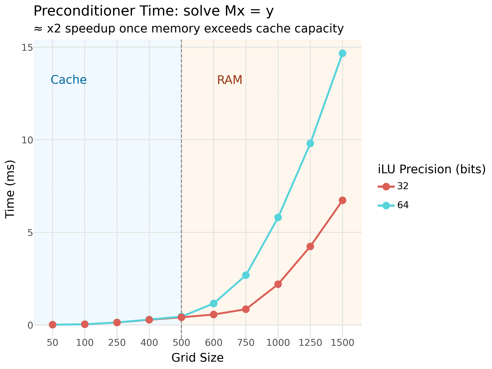

# HybridSchurLab

A Julia pedagogical implementation of a hybrid direct-iterative solver utilizing domain decomposition and implementing mixed precision

## Domain Decomposition

The matrix $A$ is reordered into a Bordered Block Diagonal form 

$$A = \begin{pmatrix} A_{II} & A_{I\gamma} \\
 A_{\gamma I} & A_{\gamma\gamma} \end{pmatrix}$$

--- 
 
The solver targets the interface problem $Sx = \hat{b}$, where $S$ is the Schur complement:
$$S = A_{\gamma\gamma} - A_{\gamma I} A_{II}^{-1} A_{I\gamma}$$

We use a Neumann-Neumann + Coarse grid preconditioner

$$M_{NN}^{-1} r = \sum_{i} R_i^T D_i S_i^{-1} D_i R_i r$$

The coarse correction is applied as:
1.  Restriction: $r_c = Z^T r$.
2.  Coarse Solve: $e_c = E^{-1} r_c$, where $E = Z^T S Z$.
3.  Prolongation: Update the solution $x = x + Z e_c$.

## Mixed Precision

local iLU factorization of $S_i$ are stored in single precision Float32 (Float32 values, Int32 indices)  
Once we reached the point where memory is the bottleneck, we observe a faster solve

